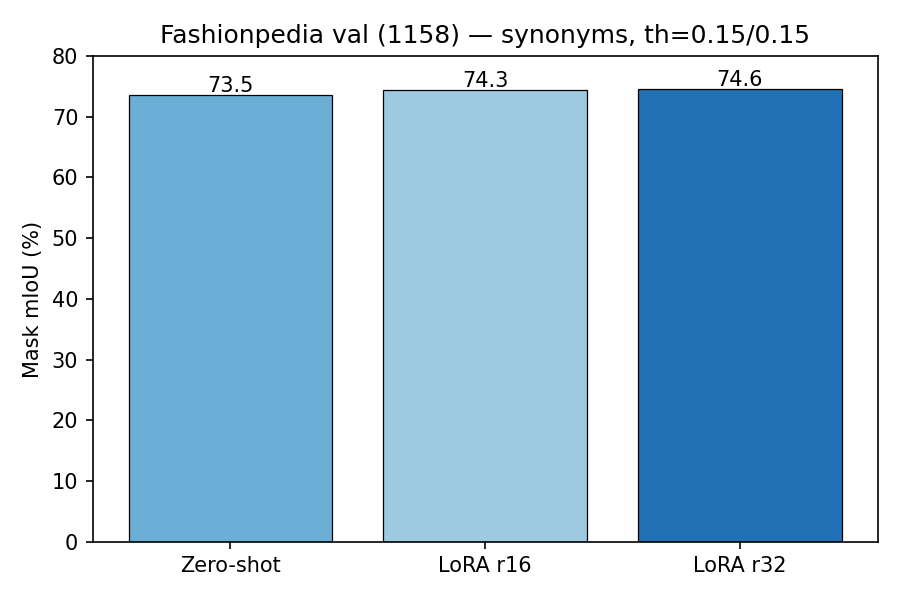
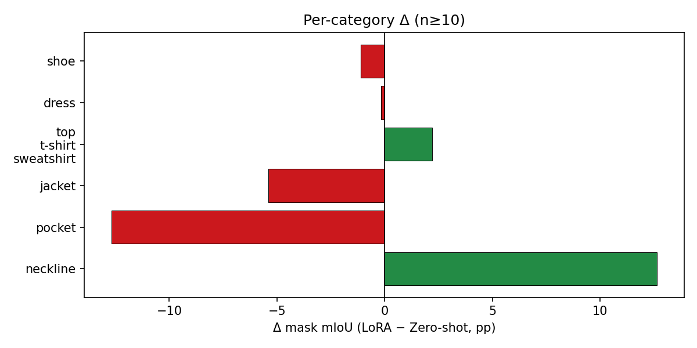
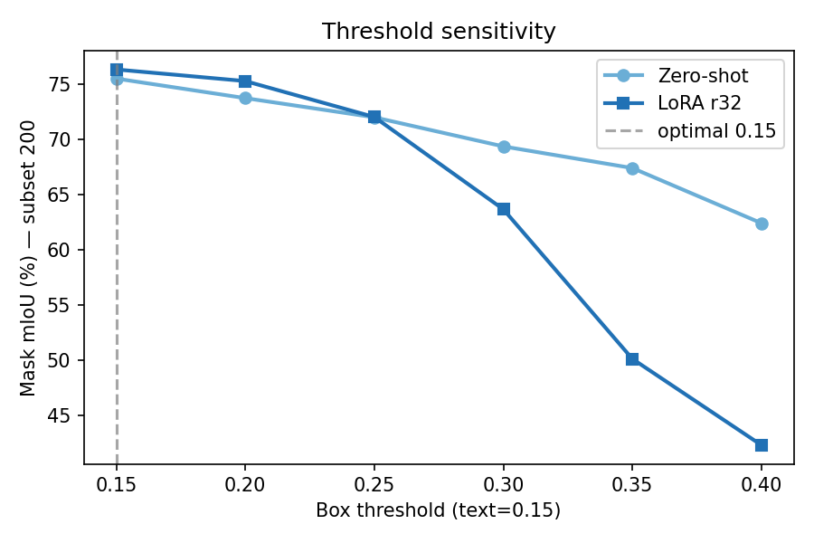

# Fashionpedia 文本驱动分割实验

Grounding DINO + SAM2 在 [Fashionpedia](https://fashionpedia.github.io/) val 上的 zero-shot、Prompt 工程与 LoRA 微调实验。

详细实验记录见 [EXPERIMENT_LOG.md](EXPERIMENT_LOG.md)。

## 环境

```bash
cd /root/autodl-tmp/Grounded-SAM-2
export TRANSFORMERS_OFFLINE=1
export HF_ENDPOINT=https://hf-mirror.com   # 国内可选
```

依赖：`transformers==4.41.2`、`peft==0.11.1`、SAM2、Grounding DINO（见 `EXPERIMENT_LOG.md` §1）。

## 数据

| 路径 | 说明 |
|------|------|
| `/root/autodl-tmp/fashionpedia/images/test/` | val 图片（1158） |
| `instances_attributes_val2020.json` | val 标注 |
| `gdino_csv/*.csv` | LoRA 训练用 CSV |

## 核心结论（th=0.15/0.15，synonyms prompt，1158 实例）

| 方法 | Mask mIoU | vs Zero-shot |
|------|----------:|-------------:|
| Zero-shot | 0.735 | — |
| LoRA r16 | 0.743 | +0.8pp |
| **LoRA r32 (v2)** | **0.746** | **+1.1pp** |

- **Prompt**：synonyms 相对 baseline +4.0pp（0.663，默认阈值）
- **阈值**：三模型最优均为 **0.15/0.15**；LoRA 在默认 0.35/0.25 下几乎不可用
- **按类**：garment parts +4.8pp；**neckline +12.6pp**（n=141）；pocket/jacket 等类 LoRA 可能下降

## 结果图表







## Failure / Success 可视化

三列对比：**GT | Zero-shot | LoRA v2**（绿=GT，红=预测）

生成命令：

```bash
python fashionpedia_failure_viz.py \
  --categories neckline pocket jacket \
  --top-k 5 \
  --output-dir outputs/failure_viz_th015
```

输出目录：`outputs/failure_viz_th015/`  
案例索引：[outputs/failure_viz_th015/GALLERY.md](outputs/failure_viz_th015/GALLERY.md)

| 类别 | 选取策略 | 观察 |
|------|----------|------|
| **neckline** | LoRA 提升最大 5 例 | ZS mIoU≈0，LoRA 拉到 0.65–0.71（**主成功叙事**） |
| **pocket** | LoRA 下降最大 5 例 | 多数 LoRA **完全漏检**（mIoU=0），ZS 已有较好框 |
| **jacket** | LoRA 下降最大 5 例 | 前 2 例 LoRA 失败明显；其余 ZS/LoRA 均≈0.9（已饱和） |

## 常用命令

```bash
# 全量评测（zero-shot）
python fashionpedia_eval.py --max-images 1158 --prompt-strategy synonyms \
  --box-threshold 0.15 --text-threshold 0.15 \
  --output-dir outputs/fashionpedia_zero_shot_synonyms_th015_best

# 全量评测（LoRA v2）
python fashionpedia_eval.py --max-images 1158 --prompt-strategy synonyms \
  --box-threshold 0.15 --text-threshold 0.15 \
  --gdino-checkpoint /root/autodl-tmp/Grounding-Dino-FineTuning/weights/fashionpedia_lora/20260614_2321/merged_swint_ogc.pth \
  --output-dir outputs/fashionpedia_lora_v2_synonyms_th015_best

# 按类 breakdown（n≥10）
python fashionpedia_category_breakdown.py \
  --lora-dir outputs/fashionpedia_lora_v2_synonyms_th015_best \
  --zs-dir outputs/fashionpedia_zero_shot_synonyms_th015_best \
  --output-dir outputs/category_breakdown_th015_lora_vs_zs_min10 \
  --min-count 10

# 阈值扫描（子集 200）
python fashionpedia_threshold_sweep.py --subset-size 200

# 生成图表
python fashionpedia_make_figures.py

# Failure case 可视化
python fashionpedia_failure_viz.py --top-k 5
```

## 脚本一览

| 脚本 | 功能 |
|------|------|
| `fashionpedia_eval.py` | 单配置全量/子集评测 |
| `fashionpedia_prompt_eval.py` | 多 Prompt 策略对比 |
| `fashionpedia_threshold_sweep.py` | 阈值网格扫描 |
| `fashionpedia_category_breakdown.py` | 按服装类别统计 Δ mIoU |
| `fashionpedia_failure_viz.py` | GT / ZS / LoRA 对比图 |
| `fashionpedia_make_figures.py` | 汇总柱状图/折线图 |
| `prompt_templates.py` | synonyms 等 Prompt 模板 |

## LoRA 训练

仓库：`/root/autodl-tmp/Grounding-Dino-FineTuning`

```bash
cd /root/autodl-tmp/Grounding-Dino-FineTuning
bash scripts/run_train.sh
python tools/export_merged_lora.py \
  --lora weights/fashionpedia_lora/<run>/checkpoint_epoch_5.pth \
  --config groundingdino/config/GroundingDINO_SwinT_OGC_localbert.py
```

## 输出目录结构

```
outputs/
├── fashionpedia_zero_shot_synonyms_th015_best/   # ZS 全量结果
├── fashionpedia_lora_v2_synonyms_th015_best/     # LoRA r32 全量
├── fashionpedia_lora_r16_synonyms_th015/         # LoRA r16 全量
├── category_breakdown_th015_lora_vs_zs_min10/    # 按类统计
├── threshold_sweep_20260615_102629/              # ZS vs LoRA 扫阈
├── threshold_sweep_r16/                          # r16 扫阈
├── failure_viz_th015/                            # 可视化对比图
└── figures/                                      # 论文用汇总图
```

## 权重

| 模型 | 路径 |
|------|------|
| GDINO SwinT | `gdino_checkpoints/groundingdino_swint_ogc.pth` |
| SAM2 | `checkpoints/sam2.1_hiera_large.pt` |
| LoRA r32 merged | `Grounding-Dino-FineTuning/weights/fashionpedia_lora/20260614_2321/merged_swint_ogc.pth` |
| LoRA r16 merged | `Grounding-Dino-FineTuning/weights/fashionpedia_lora/20260615_1330/merged_swint_ogc.pth` |
